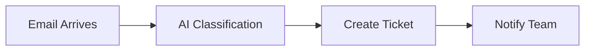

# Lesson 2: Workflow Automation Introduction

## Overview
**Duration**: 12 minutes  
**Level**: 100 - Introduction  
**Track**: Infrastructure Track

Build your first AI-powered workflow to automate common MSP tasks and improve client service delivery.

## Learning Objectives
- Set up one automation platform
- Create an AI-enhanced workflow
- Automate a real MSP task

## Business Value
- **70% reduction in manual task time**
- **Consistent service delivery**
- **24/7 automated responses**

## Platform Comparison

| Platform | Best For | Cost | Setup Time |
|----------|----------|------|------------|
| **n8n** | Custom workflows, privacy | Free | 10 minutes |
| **Power Automate** | Microsoft environments | $15/month | 5 minutes |

## Quick Start: Power Automate (Fastest for Microsoft Shops)

### Step 1: Set Up (3 minutes)
1. Go to [flow.microsoft.com](https://flow.microsoft.com)
2. Sign in with work account
3. Click "Create" → "Automated flow"

### Step 2: Build Email-to-Ticket Flow (8 minutes)

**Scenario**: Auto-process client support emails



**Step-by-Step**:
1. **Trigger**: "When a new email arrives" (Outlook)
2. **AI Action**: "Extract information from text" (AI Builder)
3. **Create**: "Create item" (SharePoint/Teams)
4. **Notify**: "Send Teams message"

### Step 3: Test Your Flow (1 minute)
1. Send test email to trigger address
2. Check if ticket was created
3. Verify team notification

## Alternative: n8n (Open Source)

### Quick Setup
```bash
# Install and start n8n
npx n8n

# Access at http://localhost:5678
```

### Simple Workflow Template
1. **Webhook** → **HTTP Request** → **Email**
2. Add AI classification via OpenAI API
3. Route based on priority level

## Common MSP Automation Patterns

### 1. Client Onboarding
- New client signed → Auto-create folders, docs, monitoring

### 2. System Alerts
- Monitoring alert → AI analysis → Route to appropriate team

### 3. Invoice Processing
- Vendor invoice → AI extraction → Client billing match

## Quick Assessment

✅ **Success Criteria**:
- [ ] Automation platform set up
- [ ] First workflow created and tested
- [ ] Email-to-ticket flow working
- [ ] Team can monitor and modify flow

## Next Steps

**Today**: Test your workflow with real data
**This Week**: Add AI classification to existing processes
**This Month**: Automate 3 routine MSP tasks

---

**Next Lesson**: [Lesson 3: Model Integration Basics](lesson-03-model-integration.md)