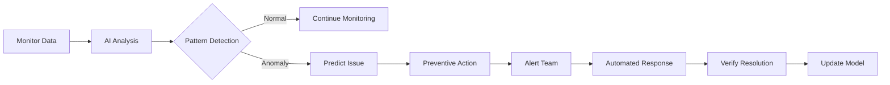

# Lesson 4: AI-Powered Monitoring & Analytics

## Overview
**Duration**: 14 minutes  
**Level**: 100 - Introduction  
**Track**: Infrastructure Track

Use AI to transform raw monitoring data into actionable insights and automate incident response.

## Learning Objectives
- Set up AI-enhanced log analysis
- Create intelligent alerting systems
- Build predictive maintenance workflows

## Business Value
- **80% reduction in false alerts**
- **Faster incident detection and response**
- **Proactive issue prevention**

## Tools Overview

| Tool | Best For | Cost | Integration Time |
|------|----------|------|------------------|
| **Datadog + AI** | APM, infrastructure | $15/host/month | 15 minutes |
| **New Relic AI** | Application monitoring | $25/month/user | 10 minutes |
| **Custom + OpenAI** | Log analysis | $10-50/month | 20 minutes |

## Quick Start: AI Log Analyzer (10 minutes)

### Step 1: Set Up Log Collection (3 minutes)
```python
import re
import json
from datetime import datetime

class LogProcessor:
    def __init__(self):
        self.patterns = {
            'error': r'ERROR|FATAL|CRITICAL',
            'warning': r'WARN|WARNING',
            'performance': r'slow|timeout|latency',
            'security': r'failed login|unauthorized|breach'
        }
    
    def extract_log_data(self, log_line):
        """Extract structured data from log line"""
        return {
            'timestamp': datetime.now().isoformat(),
            'level': self.detect_level(log_line),
            'message': log_line.strip(),
            'category': self.categorize_log(log_line)
        }
    
    def detect_level(self, log_line):
        """Detect log level using patterns"""
        for level, pattern in self.patterns.items():
            if re.search(pattern, log_line, re.IGNORECASE):
                return level
        return 'info'
    
    def categorize_log(self, log_line):
        """Categorize log entry"""
        if 'database' in log_line.lower():
            return 'database'
        elif 'network' in log_line.lower():
            return 'network'
        elif 'application' in log_line.lower():
            return 'application'
        return 'system'
```

### Step 2: Add AI Analysis (5 minutes)
```python
import openai
import os

client = openai.OpenAI(api_key=os.getenv('OPENAI_API_KEY'))

def analyze_log_pattern(log_entries):
    """Analyze log patterns using AI"""
    log_sample = '\n'.join(log_entries[-10:])  # Last 10 entries
    
    prompt = f"""
    Analyze these system logs and provide:
    1. Severity level (LOW/MEDIUM/HIGH/CRITICAL)
    2. Issue type (performance/security/error/normal)
    3. Recommended action
    4. Urgency (immediate/within_hour/within_day/monitor)
    
    Logs:
    {log_sample}
    
    Format: SEVERITY|TYPE|ACTION|URGENCY
    """
    
    response = client.chat.completions.create(
        model="gpt-3.5-turbo",
        messages=[
            {"role": "system", "content": "You are an expert system administrator analyzing server logs."},
            {"role": "user", "content": prompt}
        ],
        max_tokens=100,
        temperature=0.1
    )
    
    return response.choices[0].message.content

# Test with sample logs
sample_logs = [
    "2024-01-15 10:30:15 ERROR Database connection timeout after 30 seconds",
    "2024-01-15 10:30:16 ERROR Failed to execute query: connection lost",
    "2024-01-15 10:30:17 CRITICAL Database server unreachable"
]

analysis = analyze_log_pattern(sample_logs)
print(f"AI Analysis: {analysis}")
```

### Step 3: Intelligent Alerting (6 minutes)
```python
class IntelligentAlerting:
    def __init__(self):
        self.alert_history = []
        self.thresholds = {
            'CRITICAL': 0,      # Alert immediately
            'HIGH': 3,          # Alert after 3 similar events
            'MEDIUM': 10,       # Alert after 10 similar events
            'LOW': 50           # Alert after 50 similar events
        }
    
    def should_alert(self, severity, issue_type):
        """Determine if alert should be sent"""
        threshold = self.thresholds.get(severity, 1)
        
        # Count recent similar events
        similar_count = sum(1 for alert in self.alert_history[-100:] 
                          if alert['severity'] == severity and alert['type'] == issue_type)
        
        return similar_count >= threshold
    
    def send_alert(self, severity, issue_type, message, urgency):
        """Send alert via appropriate channel"""
        alert = {
            'timestamp': datetime.now().isoformat(),
            'severity': severity,
            'type': issue_type,
            'message': message,
            'urgency': urgency
        }
        
        # Route based on urgency
        if urgency == 'immediate':
            self.send_sms_alert(alert)
        elif urgency == 'within_hour':
            self.send_email_alert(alert)
        else:
            self.send_slack_alert(alert)
        
        self.alert_history.append(alert)
    
    def send_sms_alert(self, alert):
        """Send SMS for critical alerts"""
        # Integration with SMS service
        print(f"🚨 SMS ALERT: {alert['message']}")
    
    def send_email_alert(self, alert):
        """Send email for high priority alerts"""
        # Integration with email service
        print(f"📧 EMAIL ALERT: {alert['message']}")
    
    def send_slack_alert(self, alert):
        """Send Slack message for standard alerts"""
        # Integration with Slack
        print(f"💬 SLACK ALERT: {alert['message']}")
```

## Integration with Popular Monitoring Tools

### Datadog Integration
```python
from datadog import initialize, api
import time

def setup_datadog_ai_alerts():
    """Set up AI-enhanced Datadog alerts"""
    options = {
        'api_key': os.getenv('DATADOG_API_KEY'),
        'app_key': os.getenv('DATADOG_APP_KEY')
    }
    
    initialize(**options)
    
    # Create monitor with AI analysis
    monitor = api.Monitor.create(
        type="log alert",
        query="logs(\"service:web-app ERROR\").index(\"*\").rollup(\"count\").last(\"5m\") > 10",
        name="AI-Enhanced Error Monitor",
        message="""
        High error rate detected. 
        AI Analysis: {{#is_alert}}
        Running AI analysis on error patterns...
        {{/is_alert}}
        """,
        options={
            'thresholds': {'critical': 10, 'warning': 5},
            'notify_no_data': False,
            'renotify_interval': 30
        }
    )
```

### New Relic Integration
```python
import requests

def create_newrelic_ai_alert():
    """Create New Relic alert with AI enhancement"""
    headers = {
        'Api-Key': os.getenv('NEW_RELIC_API_KEY'),
        'Content-Type': 'application/json'
    }
    
    alert_policy = {
        "policy": {
            "name": "AI-Enhanced Monitoring",
            "incident_preference": "PER_POLICY"
        }
    }
    
    response = requests.post(
        'https://api.newrelic.com/v2/alerts_policies.json',
        headers=headers,
        json=alert_policy
    )
    
    return response.json()
```

## Predictive Analytics Workflow



## Simple Predictive Model

```python
def predict_system_health(metrics_history):
    """Simple predictive model for system health"""
    prompt = f"""
    Based on these system metrics over time, predict:
    1. Likelihood of issues in next 24 hours (0-100%)
    2. Most likely issue type
    3. Recommended preventive actions
    
    Recent metrics:
    {metrics_history}
    
    Format: LIKELIHOOD%|ISSUE_TYPE|ACTIONS
    """
    
    response = client.chat.completions.create(
        model="gpt-3.5-turbo",
        messages=[
            {"role": "system", "content": "You are a system health predictor."},
            {"role": "user", "content": prompt}
        ],
        max_tokens=150,
        temperature=0.2
    )
    
    return response.choices[0].message.content

# Example usage
metrics = [
    "CPU: 45%, Memory: 67%, Disk: 78%",
    "CPU: 52%, Memory: 71%, Disk: 79%",
    "CPU: 58%, Memory: 75%, Disk: 82%"
]

prediction = predict_system_health(metrics)
print(f"Health Prediction: {prediction}")
```

## Quick Assessment

✅ **Success Criteria**:
- [ ] Log analysis AI system working
- [ ] Intelligent alerting configured
- [ ] Integration with existing monitoring tools
- [ ] Predictive model tested

## Common Use Cases

### 1. Database Performance Issues
- **Pattern**: Slow query logs increasing
- **AI Action**: Identify problematic queries
- **Prevention**: Suggest index optimizations

### 2. Security Threats
- **Pattern**: Failed login attempts
- **AI Action**: Detect brute force attacks
- **Prevention**: Auto-block suspicious IPs

### 3. Capacity Planning
- **Pattern**: Resource usage trends
- **AI Action**: Predict capacity needs
- **Prevention**: Recommend scaling actions

## Next Steps

**Today**: Set up basic log analysis
**This Week**: Integrate with monitoring platform
**This Month**: Deploy predictive maintenance

---

**Next Lesson**: [Lesson 5: AI-Enhanced Security Basics](lesson-05-security-basics.md)