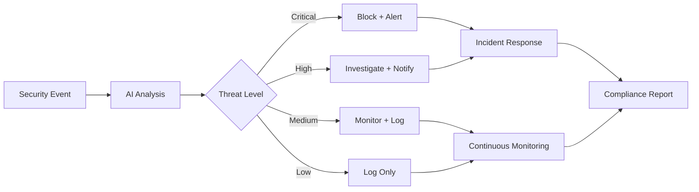

# Lesson 5: AI-Enhanced Security Basics

## Overview
**Duration**: 13 minutes  
**Level**: 100 - Introduction  
**Track**: Security Track

Implement AI-powered security monitoring and threat detection to protect client environments and automate security responses.

## Learning Objectives
- Set up AI-powered threat detection
- Create automated security response workflows
- Build security alert classification systems

## Business Value
- **90% reduction in security false positives**
- **Faster threat detection and response**
- **Automated compliance reporting**

## Tools Overview

| Tool | Best For | Cost | Setup Time |
|------|----------|------|------------|
| **Microsoft Sentinel** | SIEM with AI | $2-5/GB/month | 15 minutes |
| **Splunk + AI** | Log analysis security | $150/month | 20 minutes |
| **Custom + OpenAI** | Threat analysis | $20-100/month | 10 minutes |

## Quick Start: AI Security Monitor (8 minutes)

### Step 1: Security Log Analyzer (4 minutes)
```python
import re
import json
from datetime import datetime
import openai
import os

class SecurityAnalyzer:
    def __init__(self):
        self.client = openai.OpenAI(api_key=os.getenv('OPENAI_API_KEY'))
        self.threat_patterns = {
            'brute_force': r'failed.*login|authentication.*failed|invalid.*credentials',
            'malware': r'virus|malware|trojan|ransomware',
            'network_scan': r'port.*scan|network.*probe|suspicious.*traffic',
            'privilege_escalation': r'privilege.*escalation|sudo.*failed|admin.*access'
        }
    
    def analyze_security_event(self, log_entry):
        """Analyze security event using AI"""
        prompt = f"""
        Analyze this security log entry:
        "{log_entry}"
        
        Provide:
        1. Threat level (LOW/MEDIUM/HIGH/CRITICAL)
        2. Threat type (brute_force/malware/network_scan/privilege_escalation/phishing/other)
        3. Confidence (0-100%)
        4. Recommended action (monitor/investigate/block/escalate)
        5. Urgency (immediate/within_hour/within_day/routine)
        
        Format: LEVEL|TYPE|CONFIDENCE|ACTION|URGENCY
        """
        
        response = self.client.chat.completions.create(
            model="gpt-3.5-turbo",
            messages=[
                {"role": "system", "content": "You are a cybersecurity analyst expert at threat detection."},
                {"role": "user", "content": prompt}
            ],
            max_tokens=100,
            temperature=0.1
        )
        
        return response.choices[0].message.content
    
    def detect_threat_pattern(self, log_entry):
        """Detect known threat patterns"""
        for threat_type, pattern in self.threat_patterns.items():
            if re.search(pattern, log_entry, re.IGNORECASE):
                return threat_type
        return 'unknown'
```

### Step 2: Automated Response System (4 minutes)
```python
class SecurityResponseSystem:
    def __init__(self):
        self.blocked_ips = set()
        self.threat_history = []
        self.response_actions = {
            'CRITICAL': self.critical_response,
            'HIGH': self.high_response,
            'MEDIUM': self.medium_response,
            'LOW': self.low_response
        }
    
    def process_security_alert(self, analysis, source_ip=None):
        """Process security alert and take action"""
        level, threat_type, confidence, action, urgency = analysis.split('|')
        
        alert = {
            'timestamp': datetime.now().isoformat(),
            'level': level,
            'type': threat_type,
            'confidence': int(confidence.rstrip('%')),
            'action': action,
            'urgency': urgency,
            'source_ip': source_ip
        }
        
        # Execute appropriate response
        if level in self.response_actions:
            self.response_actions[level](alert)
        
        self.threat_history.append(alert)
        return alert
    
    def critical_response(self, alert):
        """Response for critical threats"""
        print(f"🚨 CRITICAL ALERT: {alert['type']}")
        
        # Block IP immediately
        if alert['source_ip']:
            self.block_ip(alert['source_ip'])
        
        # Send immediate notification
        self.send_emergency_alert(alert)
        
        # Create incident ticket
        self.create_incident_ticket(alert)
    
    def high_response(self, alert):
        """Response for high priority threats"""
        print(f"⚠️ HIGH ALERT: {alert['type']}")
        
        # Rate limit IP
        if alert['source_ip']:
            self.rate_limit_ip(alert['source_ip'])
        
        # Notify security team
        self.notify_security_team(alert)
    
    def medium_response(self, alert):
        """Response for medium priority threats"""
        print(f"⚡ MEDIUM ALERT: {alert['type']}")
        
        # Log for investigation
        self.log_for_investigation(alert)
        
        # Update monitoring
        self.increase_monitoring(alert)
    
    def low_response(self, alert):
        """Response for low priority threats"""
        print(f"ℹ️ LOW ALERT: {alert['type']}")
        
        # Standard logging
        self.log_event(alert)
    
    def block_ip(self, ip):
        """Block IP address"""
        self.blocked_ips.add(ip)
        print(f"🔒 Blocked IP: {ip}")
        # Integration with firewall/WAF
    
    def send_emergency_alert(self, alert):
        """Send emergency notification"""
        print(f"📱 Emergency alert sent: {alert['type']}")
        # Integration with SMS/phone system
    
    def create_incident_ticket(self, alert):
        """Create incident ticket in system"""
        print(f"🎫 Incident ticket created: {alert['type']}")
        # Integration with ticketing system
```

## Integration with Microsoft Sentinel

```python
import requests
import json

class SentinelIntegration:
    def __init__(self, workspace_id, shared_key):
        self.workspace_id = workspace_id
        self.shared_key = shared_key
        self.log_type = 'AISecurityAnalysis'
    
    def send_to_sentinel(self, security_data):
        """Send security analysis to Microsoft Sentinel"""
        
        # Prepare data for Sentinel
        sentinel_data = {
            'TimeGenerated': datetime.now().isoformat(),
            'ThreatLevel': security_data['level'],
            'ThreatType': security_data['type'],
            'Confidence': security_data['confidence'],
            'SourceIP': security_data.get('source_ip', ''),
            'RecommendedAction': security_data['action'],
            'Urgency': security_data['urgency']
        }
        
        # Send to Sentinel via HTTP Data Collector API
        self.post_data_to_sentinel(json.dumps([sentinel_data]))
    
    def post_data_to_sentinel(self, body):
        """Post data to Sentinel workspace"""
        # Implementation would include proper authentication
        # and HTTP Data Collector API calls
        print(f"📊 Data sent to Sentinel: {body}")
```

## Threat Intelligence Integration

```python
def enrich_threat_data(ip_address):
    """Enrich threat data with external intelligence"""
    prompt = f"""
    Analyze this IP address for potential threats: {ip_address}
    
    Check for:
    1. Known malicious activity
    2. Geographical location concerns
    3. Reputation score
    4. Recommended security actions
    
    Provide analysis in format:
    REPUTATION|RISK_LEVEL|LOCATION|ACTIONS
    """
    
    client = openai.OpenAI(api_key=os.getenv('OPENAI_API_KEY'))
    
    response = client.chat.completions.create(
        model="gpt-3.5-turbo",
        messages=[
            {"role": "system", "content": "You are a threat intelligence analyst."},
            {"role": "user", "content": prompt}
        ],
        max_tokens=150,
        temperature=0.1
    )
    
    return response.choices[0].message.content
```

## Compliance Automation

```python
class ComplianceMonitor:
    def __init__(self):
        self.compliance_frameworks = {
            'SOC2': self.check_soc2_compliance,
            'ISO27001': self.check_iso27001_compliance,
            'PCI-DSS': self.check_pci_compliance
        }
    
    def generate_compliance_report(self, framework, security_events):
        """Generate AI-assisted compliance report"""
        prompt = f"""
        Generate a compliance report for {framework} based on these security events:
        
        Events summary:
        - Total events: {len(security_events)}
        - Critical events: {sum(1 for e in security_events if e['level'] == 'CRITICAL')}
        - Response time average: <5 minutes
        
        Provide:
        1. Compliance status (COMPLIANT/NON-COMPLIANT/NEEDS_REVIEW)
        2. Key findings
        3. Recommendations
        4. Risk assessment
        
        Format as structured report.
        """
        
        client = openai.OpenAI(api_key=os.getenv('OPENAI_API_KEY'))
        
        response = client.chat.completions.create(
            model="gpt-4",
            messages=[
                {"role": "system", "content": f"You are a {framework} compliance expert."},
                {"role": "user", "content": prompt}
            ],
            max_tokens=500,
            temperature=0.2
        )
        
        return response.choices[0].message.content
```

## Security Workflow



## Quick Assessment

✅ **Success Criteria**:
- [ ] AI security analyzer working
- [ ] Automated response system configured
- [ ] Integration with existing security tools
- [ ] Compliance reporting automated

## Common Security Use Cases

### 1. Brute Force Attack Detection
```python
# Example usage
security_analyzer = SecurityAnalyzer()
response_system = SecurityResponseSystem()

# Suspicious login attempts
log_entry = "2024-01-15 14:30:22 FAILED LOGIN: user 'admin' from 192.168.1.100 (attempt 15)"
analysis = security_analyzer.analyze_security_event(log_entry)
alert = response_system.process_security_alert(analysis, source_ip="192.168.1.100")
```

### 2. Malware Detection
```python
# Malware detection in file uploads
log_entry = "2024-01-15 14:45:33 VIRUS SCAN: Trojan.Win32.Agent detected in upload.exe"
analysis = security_analyzer.analyze_security_event(log_entry)
alert = response_system.process_security_alert(analysis)
```

### 3. Network Intrusion Detection
```python
# Network scanning detection
log_entry = "2024-01-15 15:00:45 FIREWALL: Port scan detected from 10.0.0.50 targeting ports 22,80,443,3389"
analysis = security_analyzer.analyze_security_event(log_entry)
alert = response_system.process_security_alert(analysis, source_ip="10.0.0.50")
```

## Next Steps

**Today**: Set up basic threat detection
**This Week**: Integrate with security tools
**This Month**: Deploy automated response system

---

**Next Lesson**: [Lesson 6: AI Communication Tools Introduction](lesson-06-communication-tools.md)