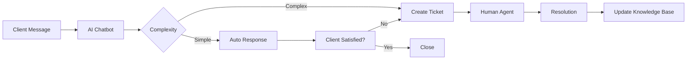

# Lesson 6: AI Communication Tools Introduction

## Overview
**Duration**: 11 minutes  
**Level**: 100 - Introduction  
**Track**: All Tracks

Build AI-powered communication tools to enhance client interactions, automate documentation, and improve team collaboration.

## Learning Objectives
- Create an AI chatbot for client support
- Automate documentation generation
- Set up intelligent knowledge management

## Business Value
- **24/7 client support availability**
- **Consistent service documentation**
- **Reduced response times**

## Tools Overview

| Tool | Best For | Cost | Setup Time |
|------|----------|------|------------|
| **Microsoft Bot Framework** | Teams/Outlook integration | $10-50/month | 15 minutes |
| **OpenAI + Custom UI** | Custom chatbots | $20-100/month | 10 minutes |
| **Notion AI** | Knowledge management | $10/user/month | 5 minutes |

## Quick Start: Client Support Chatbot (6 minutes)

### Step 1: Basic Chatbot Framework (3 minutes)
```python
import openai
import os
from datetime import datetime

class MSPChatbot:
    def __init__(self):
        self.client = openai.OpenAI(api_key=os.getenv('OPENAI_API_KEY'))
        self.knowledge_base = {
            'services': [
                'Network monitoring and maintenance',
                'Cloud infrastructure management',
                'Security services and compliance',
                'Help desk and user support',
                'Backup and disaster recovery'
            ],
            'common_issues': {
                'password_reset': 'Visit our self-service portal at portal.msp.com/reset',
                'vpn_issues': 'Check VPN connection and try reconnecting. Contact us if issues persist.',
                'email_problems': 'Verify internet connection and restart email client.',
                'slow_performance': 'Clear browser cache and restart computer. Monitor for 24 hours.'
            },
            'business_hours': 'Monday-Friday 8AM-6PM EST',
            'emergency_contact': 'For critical issues, call +1-800-MSP-HELP'
        }
    
    def generate_response(self, user_message, conversation_history=None):
        """Generate AI response for client inquiry"""
        context = f"""
        You are a helpful MSP support assistant. 
        
        Our services: {', '.join(self.knowledge_base['services'])}
        Business hours: {self.knowledge_base['business_hours']}
        Emergency contact: {self.knowledge_base['emergency_contact']}
        
        Common solutions:
        - Password reset: {self.knowledge_base['common_issues']['password_reset']}
        - VPN issues: {self.knowledge_base['common_issues']['vpn_issues']}
        - Email problems: {self.knowledge_base['common_issues']['email_problems']}
        - Slow performance: {self.knowledge_base['common_issues']['slow_performance']}
        
        User message: {user_message}
        
        Provide a helpful, professional response. If you cannot resolve the issue, 
        direct them to create a support ticket or contact our team.
        """
        
        messages = [
            {"role": "system", "content": "You are a professional MSP support assistant."},
            {"role": "user", "content": context}
        ]
        
        # Add conversation history if provided
        if conversation_history:
            messages.extend(conversation_history)
        
        response = self.client.chat.completions.create(
            model="gpt-3.5-turbo",
            messages=messages,
            max_tokens=300,
            temperature=0.3
        )
        
        return response.choices[0].message.content
    
    def classify_urgency(self, message):
        """Classify message urgency for routing"""
        urgent_keywords = ['down', 'critical', 'emergency', 'urgent', 'breach', 'attack']
        high_keywords = ['slow', 'error', 'problem', 'issue', 'not working']
        
        message_lower = message.lower()
        
        if any(keyword in message_lower for keyword in urgent_keywords):
            return 'URGENT'
        elif any(keyword in message_lower for keyword in high_keywords):
            return 'HIGH'
        else:
            return 'NORMAL'
```

### Step 2: Web Interface (2 minutes)
```html
<!DOCTYPE html>
<html>
<head>
    <title>MSP Support Chat</title>
    <style>
        .chat-container { max-width: 600px; margin: 0 auto; padding: 20px; }
        .chat-messages { height: 400px; overflow-y: auto; border: 1px solid #ccc; padding: 10px; }
        .chat-input { width: 100%; padding: 10px; margin-top: 10px; }
        .message { margin: 10px 0; padding: 8px; border-radius: 5px; }
        .user-message { background-color: #e3f2fd; text-align: right; }
        .bot-message { background-color: #f5f5f5; text-align: left; }
    </style>
</head>
<body>
    <div class="chat-container">
        <h2>MSP Support Assistant</h2>
        <div id="chat-messages" class="chat-messages"></div>
        <input type="text" id="user-input" class="chat-input" placeholder="Type your message...">
    </div>
    
    <script>
        const chatMessages = document.getElementById('chat-messages');
        const userInput = document.getElementById('user-input');
        
        userInput.addEventListener('keypress', function(e) {
            if (e.key === 'Enter') {
                sendMessage();
            }
        });
        
        function sendMessage() {
            const message = userInput.value.trim();
            if (!message) return;
            
            addMessage(message, 'user');
            userInput.value = '';
            
            // Send to backend (implement your API call here)
            fetch('/chat', {
                method: 'POST',
                headers: {'Content-Type': 'application/json'},
                body: JSON.stringify({message: message})
            })
            .then(response => response.json())
            .then(data => {
                addMessage(data.response, 'bot');
            });
        }
        
        function addMessage(message, sender) {
            const messageDiv = document.createElement('div');
            messageDiv.className = `message ${sender}-message`;
            messageDiv.textContent = message;
            chatMessages.appendChild(messageDiv);
            chatMessages.scrollTop = chatMessages.scrollHeight;
        }
    </script>
</body>
</html>
```

### Step 3: Teams Integration (1 minute)
```python
from flask import Flask, request, jsonify
import json

app = Flask(__name__)
chatbot = MSPChatbot()

@app.route('/teams-webhook', methods=['POST'])
def teams_webhook():
    """Handle Teams bot messages"""
    data = request.json
    
    # Extract message from Teams format
    user_message = data.get('text', '')
    
    # Generate response
    response = chatbot.generate_response(user_message)
    
    # Return in Teams format
    return jsonify({
        "type": "message",
        "text": response
    })

@app.route('/chat', methods=['POST'])
def chat_endpoint():
    """Handle web chat messages"""
    data = request.json
    user_message = data.get('message', '')
    
    # Classify urgency
    urgency = chatbot.classify_urgency(user_message)
    
    # Generate response
    response = chatbot.generate_response(user_message)
    
    return jsonify({
        "response": response,
        "urgency": urgency
    })
```

## Documentation Automation (3 minutes)

### Auto-Generate Client Reports
```python
class DocumentationGenerator:
    def __init__(self):
        self.client = openai.OpenAI(api_key=os.getenv('OPENAI_API_KEY'))
    
    def generate_incident_report(self, incident_data):
        """Generate incident report from data"""
        prompt = f"""
        Generate a professional incident report based on this data:
        
        Incident: {incident_data['title']}
        Start Time: {incident_data['start_time']}
        End Time: {incident_data['end_time']}
        Affected Systems: {incident_data['affected_systems']}
        Root Cause: {incident_data['root_cause']}
        Resolution: {incident_data['resolution']}
        
        Format as a professional incident report with:
        1. Executive Summary
        2. Timeline
        3. Impact Assessment
        4. Root Cause Analysis
        5. Resolution Steps
        6. Preventive Measures
        """
        
        response = self.client.chat.completions.create(
            model="gpt-4",
            messages=[
                {"role": "system", "content": "You are a technical writer specializing in incident reports."},
                {"role": "user", "content": prompt}
            ],
            max_tokens=800,
            temperature=0.2
        )
        
        return response.choices[0].message.content
    
    def generate_monthly_report(self, metrics_data):
        """Generate monthly service report"""
        prompt = f"""
        Generate a monthly MSP service report:
        
        Metrics:
        - Uptime: {metrics_data['uptime']}%
        - Tickets Resolved: {metrics_data['tickets_resolved']}
        - Average Response Time: {metrics_data['avg_response_time']} minutes
        - Security Incidents: {metrics_data['security_incidents']}
        - Backup Success Rate: {metrics_data['backup_success']}%
        
        Create a professional report with charts descriptions and recommendations.
        """
        
        response = self.client.chat.completions.create(
            model="gpt-4",
            messages=[
                {"role": "system", "content": "You are an MSP service reporting specialist."},
                {"role": "user", "content": prompt}
            ],
            max_tokens=600,
            temperature=0.2
        )
        
        return response.choices[0].message.content
```

## Knowledge Management (2 minutes)

### Smart Knowledge Base
```python
class SmartKnowledgeBase:
    def __init__(self):
        self.client = openai.OpenAI(api_key=os.getenv('OPENAI_API_KEY'))
        self.knowledge_articles = []
    
    def search_knowledge(self, query):
        """Search knowledge base using AI"""
        prompt = f"""
        Search query: {query}
        
        Available knowledge articles:
        {self.format_articles_for_search()}
        
        Return the most relevant articles and a suggested answer.
        """
        
        response = self.client.chat.completions.create(
            model="gpt-3.5-turbo",
            messages=[
                {"role": "system", "content": "You are a knowledge base search assistant."},
                {"role": "user", "content": prompt}
            ],
            max_tokens=300,
            temperature=0.3
        )
        
        return response.choices[0].message.content
    
    def format_articles_for_search(self):
        """Format articles for AI search"""
        return "\n".join([f"- {article['title']}: {article['summary']}" 
                         for article in self.knowledge_articles])
    
    def auto_categorize_article(self, article_content):
        """Auto-categorize new knowledge articles"""
        prompt = f"""
        Categorize this knowledge article:
        "{article_content}"
        
        Categories:
        - Network & Infrastructure
        - Security & Compliance  
        - Software & Applications
        - Hardware & Devices
        - Backup & Recovery
        - User Support
        
        Return: CATEGORY|PRIORITY|TAGS
        """
        
        response = self.client.chat.completions.create(
            model="gpt-3.5-turbo",
            messages=[
                {"role": "system", "content": "You are a knowledge management specialist."},
                {"role": "user", "content": prompt}
            ],
            max_tokens=100,
            temperature=0.1
        )
        
        return response.choices[0].message.content
```

## Communication Workflow



## Quick Assessment

✅ **Success Criteria**:
- [ ] AI chatbot responding to queries
- [ ] Documentation auto-generation working
- [ ] Knowledge base search functional
- [ ] Integration with communication platforms

## Common Use Cases

### 1. Client Support Chat
- **Query**: "Our email is down"
- **AI Response**: Diagnose issue, provide immediate steps, escalate if needed

### 2. Automated Reporting
- **Monthly Reports**: Generate from system metrics
- **Incident Reports**: Auto-create from ticket data
- **Compliance Reports**: Generate from security logs

### 3. Knowledge Management
- **Search**: Find relevant articles instantly
- **Categorization**: Auto-organize new content
- **Updates**: Keep knowledge base current

## Next Steps

**Today**: Deploy basic chatbot
**This Week**: Integrate with Teams/Slack
**This Month**: Add advanced knowledge features

---

**Congratulations!** You've completed the Level 100 Introduction course. Ready for [Level 200 - Intermediate](../200%20-%20Intermediate/README.md)?