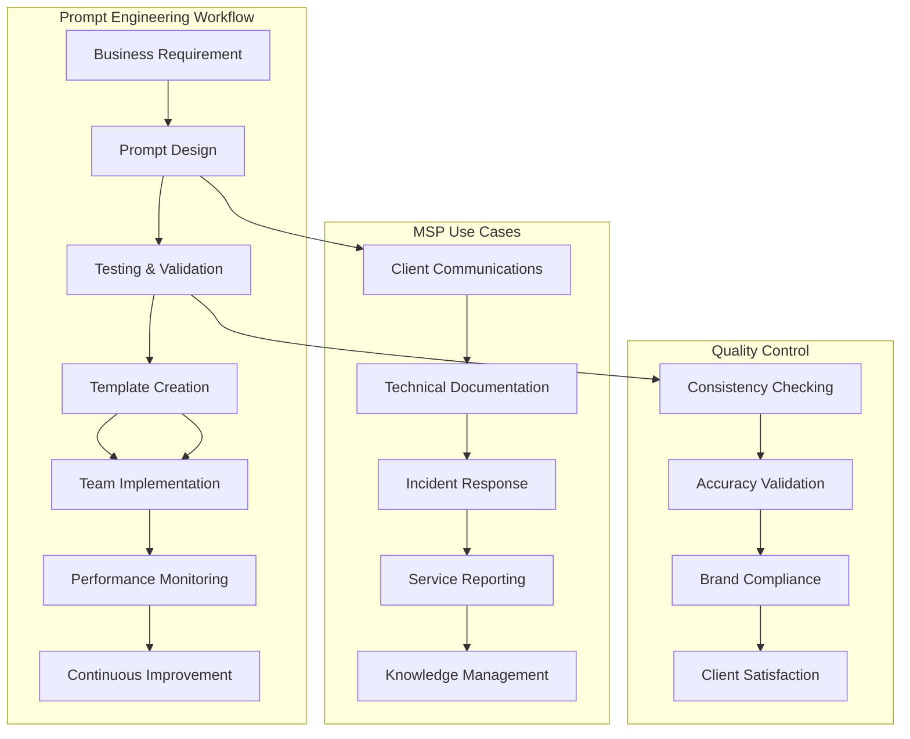

# Prompt Engineering for MSP Operations

## Overview
**Duration**: 90 minutes  
**Level**: 200 - Intermediate  
**Track**: All Tracks

Master advanced prompt engineering techniques to create reliable, consistent AI outputs for MSP workflows, client communications, and technical documentation.

## Learning Objectives
- Design effective prompts for MSP-specific use cases
- Build prompt templates for consistent service delivery
- Implement prompt chaining for complex workflows
- Create validation and quality control systems

## Business Value
- **90% more consistent AI outputs**
- **Reduced prompt iteration time by 70%**
- **Standardized service delivery across teams**
- **Improved client communication quality**

## Prerequisites
- Completed Level 100 lessons
- Basic understanding of AI model capabilities
- Experience with MSP service workflows

## Prompt Engineering Fundamentals for MSPs



## MSP Prompt Design Patterns

### 1. The Service Context Pattern

**Plain English Prompt:**

> You are a professional MSP service representative for [Client Name].
>
> - The client is: [Client Name]
> - The service type is: [Service Type]
> - The urgency level is: [Urgency Level]
>
> Please respond according to these service standards:
> - Be professional, proactive, and solution-focused.
> - Communicate clearly, using technical language when appropriate, but always be empathetic.
>
> When responding, always:
> 1. Acknowledge the client’s concern.
> 2. Provide clear next steps and timelines.
> 3. Offer proactive recommendations.
> 4. Include any relevant documentation or resources.
> 5. Set appropriate expectations.
>
> Your response must:
> - Use a professional tone suitable for business communication.
> - Include specific actions and timelines.
> - Reference any relevant SLA commitments.
> - Provide an escalation path if needed.

<br>
<br>
  

image.png


### 2. The Technical Analysis Pattern
```python
# technical_analysis_template.py
class TechnicalAnalysisPrompt:
    def __init__(self, analysis_type, data_source, output_format):
        self.analysis_type = analysis_type
        self.data_source = data_source
        self.output_format = output_format
    
    def create_analysis_prompt(self, technical_data):
        return f"""
        Perform {self.analysis_type} analysis on the following technical data:
        
        Data Source: {self.data_source}
        Analysis Type: {self.analysis_type}
        
        Technical Data:
        {technical_data}
        
        Analysis Framework:
        1. Identify patterns and anomalies
        2. Assess severity and impact
        3. Determine root causes
        4. Provide specific recommendations
        5. Include preventive measures
        
        Output Requirements:
        - Format: {self.output_format}
        - Include confidence levels for findings
        - Provide actionable recommendations
        - Reference industry best practices
        - Include timeline for implementation
        
        Technical Standards:
        - Use precise technical terminology
        - Include relevant metrics and thresholds
        - Reference applicable compliance frameworks
        - Consider scalability and performance impact
        """

# Usage examples
log_analysis = TechnicalAnalysisPrompt(
    analysis_type="Log Analysis",
    data_source="System Logs",
    output_format="Structured Report"
)

performance_analysis = TechnicalAnalysisPrompt(
    analysis_type="Performance Analysis",
    data_source="Monitoring Metrics",
    output_format="Dashboard Summary"
)
```

### 3. The Escalation Management Pattern
```python
# escalation_prompt_template.py
class EscalationPrompt:
    def __init__(self, escalation_level, stakeholder_type, communication_channel):
        self.escalation_level = escalation_level
        self.stakeholder_type = stakeholder_type
        self.communication_channel = communication_channel
        self.escalation_matrix = {
            "Level 1": {"audience": "Technical Team", "tone": "Technical", "detail": "High"},
            "Level 2": {"audience": "Management", "tone": "Business-focused", "detail": "Medium"},
            "Level 3": {"audience": "Executive", "tone": "Strategic", "detail": "Summary"}
        }
    
    def build_escalation_prompt(self, incident_data):
        matrix = self.escalation_matrix.get(self.escalation_level, {})
        
        return f"""
        Create an escalation communication for {self.escalation_level} stakeholders.
        
        Incident Data:
        {incident_data}
        
        Communication Parameters:
        - Escalation Level: {self.escalation_level}
        - Stakeholder Type: {self.stakeholder_type}
        - Communication Channel: {self.communication_channel}
        - Audience: {matrix.get('audience', 'General')}
        - Tone: {matrix.get('tone', 'Professional')}
        - Detail Level: {matrix.get('detail', 'Appropriate')}
        
        Escalation Communication Structure:
        1. Immediate Impact Summary
        2. Current Status and Actions Taken
        3. Next Steps and Timeline
        4. Resource Requirements (if applicable)
        5. Risk Assessment and Mitigation
        6. Communication Schedule
        
        Stakeholder-Specific Requirements:
        - Technical Team: Include technical details, commands, configurations
        - Management: Focus on business impact, resource needs, timeline
        - Executive: Strategic impact, client relationship, reputation considerations
        
        Output Format:
        - Subject line optimized for urgency and clarity
        - Structured content with clear sections
        - Action items with owners and deadlines
        - Contact information for immediate follow-up
        """
```

## Advanced Prompt Engineering Techniques

### 1. Prompt Chaining for Complex Workflows
```python
# prompt_chaining.py
class PromptChain:
    def __init__(self, ai_client):
        self.ai_client = ai_client
        self.chain_results = []
    
    def execute_incident_response_chain(self, incident_data):
        """Execute a multi-step incident response using prompt chaining"""
        
        # Step 1: Initial Assessment
        assessment_prompt = f"""
        Analyze this incident and provide initial assessment:
        
        Incident Data: {incident_data}
        
        Provide:
        1. Severity classification (Critical/High/Medium/Low)
        2. Affected systems and services
        3. Initial impact assessment
        4. Immediate containment actions needed
        5. Estimated resolution timeframe
        
        Format as JSON with clear fields for next processing step.
        """
        
        assessment_result = self.ai_client.generate(assessment_prompt)
        self.chain_results.append({"step": "assessment", "result": assessment_result})
        
        # Step 2: Communication Planning
        communication_prompt = f"""
        Based on this incident assessment, create a communication plan:
        
        Assessment Results: {assessment_result}
        
        Create communication strategy including:
        1. Stakeholder notification matrix
        2. Communication templates for each audience
        3. Update schedule and frequency
        4. Escalation triggers and procedures
        5. Status page messaging
        
        Consider business hours, client impact, and SLA requirements.
        """
        
        communication_result = self.ai_client.generate(communication_prompt)
        self.chain_results.append({"step": "communication", "result": communication_result})
        
        # Step 3: Technical Response Plan
        technical_prompt = f"""
        Develop technical response plan based on assessment:
        
        Incident Assessment: {assessment_result}
        Communication Plan: {communication_result}
        
        Create detailed technical response including:
        1. Diagnostic steps and commands
        2. Remediation procedures
        3. Rollback plans if needed
        4. Verification and testing steps
        5. Documentation requirements
        
        Include specific commands, configuration changes, and verification criteria.
        """
        
        technical_result = self.ai_client.generate(technical_prompt)
        self.chain_results.append({"step": "technical", "result": technical_result})
        
        # Step 4: Post-Incident Analysis
        postmortem_prompt = f"""
        Prepare post-incident analysis framework:
        
        Incident Response Data:
        - Assessment: {assessment_result}
        - Communication: {communication_result}
        - Technical Response: {technical_result}
        
        Create post-incident analysis template including:
        1. Timeline reconstruction
        2. Root cause analysis framework
        3. Response effectiveness evaluation
        4. Lessons learned capture
        5. Preventive measures recommendations
        
        Structure for client presentation and internal improvement.
        """
        
        postmortem_result = self.ai_client.generate(postmortem_prompt)
        self.chain_results.append({"step": "postmortem", "result": postmortem_result})
        
        return self.chain_results
```

### 2. Dynamic Prompt Adaptation
```python
# dynamic_prompt_adapter.py
class DynamicPromptAdapter:
    def __init__(self):
        self.client_profiles = {}
        self.service_contexts = {}
        self.performance_metrics = {}
    
    def adapt_prompt_for_client(self, base_prompt, client_id):
        """Adapt prompt based on client profile and history"""
        
        client_profile = self.get_client_profile(client_id)
        
        adapted_prompt = f"""
        {base_prompt}
        
        Client-Specific Adaptations:
        - Industry: {client_profile.get('industry', 'General')}
        - Technical Sophistication: {client_profile.get('tech_level', 'Intermediate')}
        - Communication Preference: {client_profile.get('comm_style', 'Professional')}
        - Previous Issues: {client_profile.get('common_issues', [])}
        - Preferred Solutions: {client_profile.get('preferred_approaches', [])}
        
        Historical Context:
        - Resolution Success Rate: {client_profile.get('resolution_rate', 'N/A')}
        - Average Response Time: {client_profile.get('avg_response_time', 'N/A')}
        - Escalation Frequency: {client_profile.get('escalation_rate', 'N/A')}
        
        Adaptation Instructions:
        1. Adjust technical depth based on client's technical sophistication
        2. Use industry-specific terminology and examples
        3. Reference previous successful resolutions when relevant
        4. Anticipate likely follow-up questions based on history
        5. Proactively address known client concerns
        """
        
        return adapted_prompt
    
    def get_client_profile(self, client_id):
        """Retrieve or create client profile for prompt adaptation"""
        if client_id not in self.client_profiles:
            # Initialize default profile
            self.client_profiles[client_id] = {
                'industry': 'General',
                'tech_level': 'Intermediate',
                'comm_style': 'Professional',
                'common_issues': [],
                'preferred_approaches': [],
                'resolution_rate': 0.85,
                'avg_response_time': '2 hours',
                'escalation_rate': 0.15
            }
        
        return self.client_profiles[client_id]
```

### 3. Prompt Validation and Quality Control
```python
# prompt_validator.py
class PromptValidator:
    def __init__(self):
        self.quality_criteria = {
            'clarity': {'weight': 0.3, 'threshold': 0.8},
            'completeness': {'weight': 0.25, 'threshold': 0.85},
            'accuracy': {'weight': 0.3, 'threshold': 0.9},
            'professionalism': {'weight': 0.15, 'threshold': 0.85}
        }
    
    def validate_prompt_output(self, prompt, output, expected_criteria):
        """Validate AI output against quality criteria"""
        
        validation_prompt = f"""
        Evaluate this AI output against MSP service quality standards:
        
        Original Prompt: {prompt}
        AI Output: {output}
        Expected Criteria: {expected_criteria}
        
        Evaluation Framework:
        1. Clarity (30%): Is the response clear and easy to understand?
        2. Completeness (25%): Does it address all aspects of the request?
        3. Accuracy (30%): Is the technical information correct?
        4. Professionalism (15%): Does it meet MSP communication standards?
        
        For each criterion, provide:
        - Score (0-100)
        - Specific feedback
        - Improvement recommendations
        
        Overall Assessment:
        - Pass/Fail decision
        - Priority improvements needed
        - Confidence level in the output
        
        Format as structured JSON for processing.
        """
        
        return self.ai_client.generate(validation_prompt)
    
    def auto_improve_prompt(self, original_prompt, validation_results):
        """Automatically improve prompt based on validation feedback"""
        
        improvement_prompt = f"""
        Improve this prompt based on validation feedback:
        
        Original Prompt: {original_prompt}
        Validation Results: {validation_results}
        
        Improvement Strategy:
        1. Address specific quality issues identified
        2. Enhance clarity and specificity
        3. Add missing context or requirements
        4. Improve instruction structure
        5. Add quality control checkpoints
        
        Create an improved version that:
        - Resolves identified weaknesses
        - Maintains original intent and requirements
        - Adds appropriate constraints and validation
        - Includes better examples or guidance
        - Structures instructions more clearly
        
        Provide both the improved prompt and explanation of changes made.
        """
        
        return self.ai_client.generate(improvement_prompt)
```

## MSP-Specific Prompt Libraries

### 1. Client Communication Templates
```python
# client_communication_prompts.py
class ClientCommunicationPrompts:
    @staticmethod
    def incident_notification(severity, impact, eta):
        return f"""
        Create a client incident notification with professional, reassuring tone:
        
        Incident Details:
        - Severity: {severity}
        - Impact: {impact}
        - Estimated Resolution: {eta}
        
        Communication Requirements:
        1. Acknowledge the issue clearly
        2. Explain current status and actions taken
        3. Provide realistic timeline for resolution
        4. Offer alternative solutions if applicable
        5. Include contact information for updates
        6. Maintain professional, confident tone
        
        Structure:
        - Subject: Clear, urgent but not alarming
        - Opening: Immediate acknowledgment
        - Details: Current status and actions
        - Timeline: Realistic expectations
        - Next Steps: Clear communication plan
        - Contact: Direct access for questions
        
        Brand Guidelines:
        - Professional but empathetic tone
        - Focus on solutions, not problems
        - Proactive communication approach
        - Client-focused language
        """
    
    @staticmethod
    def service_report_summary(metrics, achievements, recommendations):
        return f"""
        Generate executive summary for monthly service report:
        
        Performance Metrics: {metrics}
        Key Achievements: {achievements}
        Recommendations: {recommendations}
        
        Executive Summary Requirements:
        1. Lead with positive achievements and value delivered
        2. Present metrics in business context
        3. Address any challenges with solutions
        4. Include strategic recommendations
        5. Emphasize partnership and future value
        
        Structure:
        - Executive Overview (2-3 sentences)
        - Key Performance Highlights
        - Service Achievements This Month
        - Strategic Recommendations
        - Looking Forward
        
        Tone: Professional, confident, partnership-focused
        Length: 300-400 words maximum
        Audience: C-level executives and decision makers
        """
    
    @staticmethod
    def technical_explanation(technical_issue, audience_level):
        return f"""
        Explain this technical issue for {audience_level} audience:
        
        Technical Issue: {technical_issue}
        Audience Level: {audience_level}
        
        Explanation Strategy:
        - Non-technical: Use analogies, focus on business impact
        - Semi-technical: Basic technical concepts, practical implications
        - Technical: Detailed technical analysis, implementation specifics
        
        Required Elements:
        1. What happened (in appropriate detail level)
        2. Why it happened (root cause in accessible terms)
        3. How it was resolved (solution approach)
        4. What we're doing to prevent recurrence
        5. Any actions needed from the client
        
        Communication Style:
        - Clear, jargon-free language for non-technical
        - Professional technical terminology for technical audience
        - Always include business impact and next steps
        - Maintain confidence while being transparent
        """
```

### 2. Documentation Generation Prompts
```python
# documentation_prompts.py
class DocumentationPrompts:
    @staticmethod
    def api_documentation(endpoint_data, examples):
        return f"""
        Generate comprehensive API documentation:
        
        Endpoint Data: {endpoint_data}
        Usage Examples: {examples}
        
        Documentation Structure:
        1. Overview and Purpose
        2. Authentication Requirements
        3. Request Format
           - URL structure
           - HTTP method
           - Headers required
           - Parameters (required/optional)
           - Request body schema
        4. Response Format
           - Success response schema
           - Error response formats
           - HTTP status codes
        5. Examples
           - cURL examples
           - Code examples (Python, JavaScript)
           - Response examples
        6. Error Handling
           - Common errors
           - Troubleshooting guide
        
        Quality Standards:
        - Clear, concise descriptions
        - Complete parameter documentation
        - Practical examples
        - Error scenarios covered
        - Integration guidance included
        """
    
    @staticmethod
    def deployment_guide(infrastructure, requirements):
        return f"""
        Create deployment guide for MSP client:
        
        Infrastructure: {infrastructure}
        Requirements: {requirements}
        
        Deployment Guide Structure:
        1. Prerequisites
           - System requirements
           - Dependencies
           - Access requirements
        2. Installation Steps
           - Step-by-step procedures
           - Command examples
           - Configuration files
        3. Configuration
           - Environment variables
           - Security settings
           - Performance tuning
        4. Verification
           - Health checks
           - Testing procedures
           - Monitoring setup
        5. Troubleshooting
           - Common issues
           - Log locations
           - Diagnostic commands
        6. Maintenance
           - Update procedures
           - Backup processes
           - Scaling considerations
        
        MSP Standards:
        - Include rollback procedures
        - Document all security configurations
        - Provide monitoring and alerting setup
        - Include client-specific customizations
        """
```

### 3. Incident Response Prompts
```python
# incident_response_prompts.py
class IncidentResponsePrompts:
    @staticmethod
    def initial_assessment(incident_data):
        return f"""
        Perform initial incident assessment:
        
        Incident Data: {incident_data}
        
        Assessment Framework:
        1. Severity Classification
           - Critical: Complete service outage, data loss, security breach
           - High: Major functionality impaired, significant user impact
           - Medium: Partial functionality affected, workaround available
           - Low: Minor issues, minimal impact
        
        2. Impact Analysis
           - Number of affected users/systems
           - Business processes impacted
           - Financial implications
           - Compliance/regulatory concerns
        
        3. Immediate Actions Required
           - Containment steps
           - Communication requirements
           - Resource allocation needs
           - Escalation triggers
        
        4. Initial Response Plan
           - Diagnostic steps
           - Mitigation strategies
           - Recovery procedures
           - Documentation requirements
        
        Output Format:
        - Severity: [Level] with justification
        - Impact: Quantified business impact
        - Immediate Actions: Prioritized action list
        - Timeline: Estimated resolution timeframe
        - Resources: Required team members and tools
        - Communication: Stakeholder notification plan
        """
    
    @staticmethod
    def root_cause_analysis(incident_timeline, evidence):
        return f"""
        Conduct root cause analysis:
        
        Incident Timeline: {incident_timeline}
        Evidence Collected: {evidence}
        
        Root Cause Analysis Framework:
        1. Timeline Reconstruction
           - Chronological sequence of events
           - Key decision points
           - System state changes
        
        2. Contributing Factors
           - Technical factors
           - Process factors
           - Human factors
           - Environmental factors
        
        3. Root Cause Identification
           - Primary root cause
           - Secondary contributing causes
           - Systemic issues
        
        4. Impact Assessment
           - Direct impact
           - Indirect consequences
           - Opportunity costs
        
        5. Prevention Measures
           - Immediate fixes
           - Process improvements
           - System enhancements
           - Training needs
        
        Analysis Standards:
        - Use "5 Whys" methodology
        - Focus on system improvements, not blame
        - Include measurable prevention metrics
        - Consider both technical and process solutions
        """
```

## Quality Control and Testing

### Prompt Testing Framework
```python
# prompt_testing.py
class PromptTestingFramework:
    def __init__(self):
        self.test_scenarios = []
        self.performance_metrics = {}
    
    def create_test_scenario(self, scenario_name, input_data, expected_output, success_criteria):
        """Create a test scenario for prompt validation"""
        
        test_scenario = {
            'name': scenario_name,
            'input': input_data,
            'expected': expected_output,
            'criteria': success_criteria,
            'results': []
        }
        
        self.test_scenarios.append(test_scenario)
        return test_scenario
    
    def run_prompt_tests(self, prompt_template, test_iterations=5):
        """Run multiple tests against a prompt template"""
        
        results = []
        
        for scenario in self.test_scenarios:
            scenario_results = []
            
            for iteration in range(test_iterations):
                # Generate prompt with test data
                test_prompt = prompt_template.format(**scenario['input'])
                
                # Execute prompt
                ai_output = self.ai_client.generate(test_prompt)
                
                # Evaluate against criteria
                evaluation = self.evaluate_output(
                    ai_output, 
                    scenario['expected'], 
                    scenario['criteria']
                )
                
                scenario_results.append({
                    'iteration': iteration + 1,
                    'output': ai_output,
                    'evaluation': evaluation,
                    'passed': evaluation['overall_score'] >= 0.8
                })
            
            scenario['results'] = scenario_results
            results.append(scenario)
        
        return results
    
    def evaluate_output(self, actual_output, expected_output, criteria):
        """Evaluate AI output against test criteria"""
        
        evaluation_prompt = f"""
        Evaluate this AI output against test criteria:
        
        Actual Output: {actual_output}
        Expected Output: {expected_output}
        Success Criteria: {criteria}
        
        Evaluation Metrics:
        1. Accuracy: How well does it match expected content?
        2. Completeness: Are all required elements present?
        3. Format: Does it follow the specified format?
        4. Professionalism: Does it meet MSP communication standards?
        5. Actionability: Are recommendations specific and implementable?
        
        For each metric, provide:
        - Score (0-100)
        - Specific feedback
        - Pass/fail determination
        
        Overall Assessment:
        - Overall score (0-100)
        - Key strengths
        - Areas for improvement
        - Recommendation (pass/fail/needs revision)
        
        Format as JSON for processing.
        """
        
        return self.ai_client.generate(evaluation_prompt)
```

## Implementation Strategy

### Phase 1: Foundation (Week 1-2)
1. **Audit Current Prompts**
   - Inventory existing AI usage
   - Identify inconsistencies
   - Catalog use cases

2. **Design Prompt Standards**
   - Create template library
   - Establish quality criteria
   - Define validation process

### Phase 2: Core Implementation (Week 3-6)
1. **Build Prompt Library**
   - Client communication templates
   - Technical documentation prompts
   - Incident response workflows

2. **Implement Quality Control**
   - Validation framework
   - Testing procedures
   - Performance monitoring

### Phase 3: Advanced Features (Week 7-10)
1. **Dynamic Adaptation**
   - Client-specific customization
   - Context-aware prompts
   - Performance optimization

2. **Integration & Automation**
   - Workflow integration
   - API development
   - Training programs

## Practical Exercise: Build Your MSP Prompt Library

### Exercise 1: Client Communication Prompt (30 minutes)
**Scenario**: Create a prompt template for notifying clients about scheduled maintenance.

**Requirements**:
- Professional, reassuring tone
- Clear timeline and impact
- Proactive communication
- Contact information

**Success Criteria**:
- Consistent output across multiple tests
- Appropriate tone for different client types
- Complete information coverage
- Professional presentation

### Exercise 2: Technical Analysis Prompt (45 minutes)
**Scenario**: Design a prompt for analyzing system performance metrics.

**Requirements**:
- Structured analysis framework
- Actionable recommendations
- Risk assessment
- Implementation guidance

**Success Criteria**:
- Accurate technical analysis
- Prioritized recommendations
- Clear implementation steps
- Measurable success criteria

### Exercise 3: Incident Response Chain (60 minutes)
**Scenario**: Build a prompt chain for complete incident response workflow.

**Requirements**:
- Multi-step analysis process
- Stakeholder communication
- Technical resolution
- Post-incident review

**Success Criteria**:
- Comprehensive incident handling
- Appropriate stakeholder communication
- Effective technical resolution
- Learning capture and improvement

## Success Metrics and KPIs

### Prompt Performance Metrics
- **Consistency Score**: 95%+ similar outputs for identical inputs
- **Quality Score**: 90%+ outputs meeting MSP standards
- **Efficiency**: 70% reduction in prompt iteration time
- **Accuracy**: 95%+ technically correct information

### Business Impact Metrics
- **Client Satisfaction**: Improved communication quality scores
- **Team Efficiency**: Reduced time spent on routine communications
- **Service Quality**: More consistent service delivery
- **Training Time**: Reduced onboarding time for new team members

## Advanced Topics and Next Steps

### Integration with MSP Tools
- CRM system integration
- Ticketing system workflows
- Documentation platforms
- Monitoring and alerting systems

### Advanced Prompt Techniques
- Few-shot learning examples
- Chain-of-thought reasoning
- Constitutional AI principles
- Multi-modal prompt engineering

### Continuous Improvement
- Performance monitoring
- A/B testing frameworks
- Client feedback integration
- Regular template updates

## Assessment and Certification

### Practical Assessment
1. **Prompt Design Portfolio** (40%)
   - 5 different MSP use case prompts
   - Quality and consistency demonstration
   - Testing and validation results

2. **Implementation Project** (40%)
   - Deploy prompt library in real MSP environment
   - Measure performance improvements
   - Document lessons learned

3. **Presentation and Defense** (20%)
   - Present prompt engineering strategy
   - Demonstrate business value
   - Defend design decisions

### Certification Requirements
- Complete all exercises with 85%+ scores
- Successfully implement 3 prompt templates in production
- Demonstrate measurable improvement in service quality
- Pass final assessment with 90%+ score

## Resources and References

### Essential Reading
- [Prompt Engineering Guide](https://www.promptingguide.ai/)
- [MSP Communication Best Practices](https://www.mspalliance.com/)
- [AI Safety and Alignment](https://www.anthropic.com/safety)

### Tools and Platforms
- [OpenAI Playground](https://platform.openai.com/playground)
- [Claude AI Console](https://console.anthropic.com/)
- [Prompt Testing Tools](https://github.com/promptfoo/promptfoo)

### Community and Support
- MSP AI Community Forums
- Prompt Engineering Discord
- Monthly Best Practices Webinars

---

**Next Steps**: Apply these techniques to your MSP operations and measure the impact on service quality and team efficiency. Consider advancing to Level 300 for enterprise-scale prompt engineering strategies.

<function_calls>
<invoke name="TodoWrite">
<parameter name="todos">[{"id": "1", "content": "Create 200 - Intermediate lesson on Prompt Engineering", "status": "completed", "priority": "high"}]