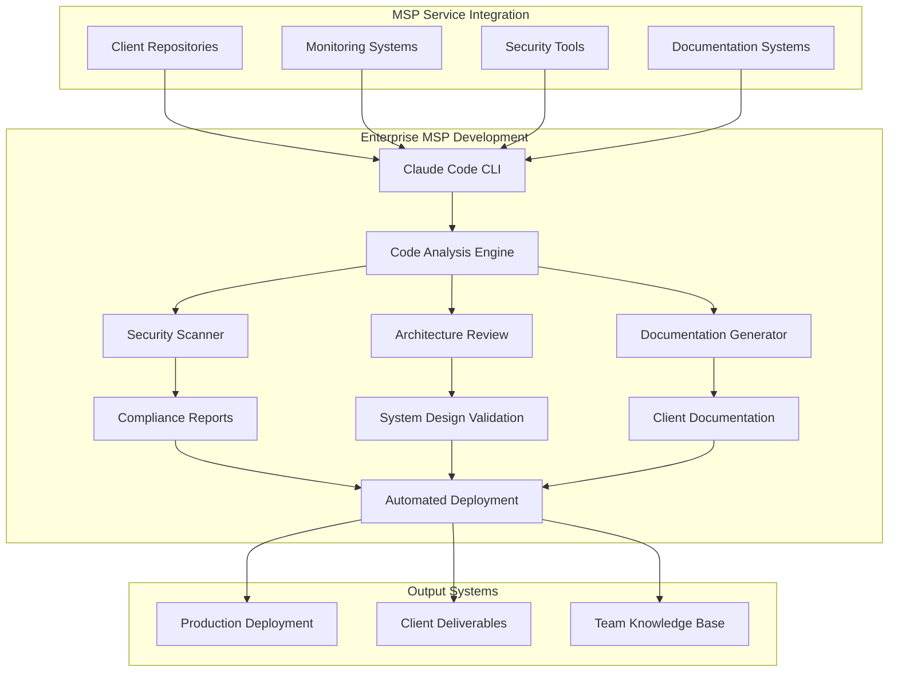

# Advanced Claude Code for MSP Operations

## Overview
**Duration**: 45 minutes  
**Level**: 300 - Advanced  
**Track**: Developer Track

Master advanced Claude Code techniques for complex MSP development, architecture analysis, and automated code reviews at enterprise scale.

## Learning Objectives
- Implement advanced Claude Code workflows for MSP operations
- Automate complex code reviews and security analysis
- Build sophisticated AI-powered development pipelines
- Create enterprise-scale documentation systems

## Business Value
- **70% faster complex project delivery**
- **Automated security and compliance checking**
- **Standardized code quality across teams**
- **Reduced technical debt and maintenance costs**

## Prerequisites
- Completed Level 100 AI Development Tools
- Experience with command-line tools
- Understanding of MSP service architectures
- Basic Python/PowerShell knowledge

## Advanced Claude Code Architecture



## Advanced Setup and Configuration

### Enterprise Claude Code Configuration
```bash
# Install Claude Code with advanced features
curl -fsSL https://claude.ai/install.sh | sh

# Configure for MSP environment
claude config set --workspace msp-operations
claude config set --model claude-3-opus  # For complex analysis
claude config set --context-length 200000  # Large codebases

# Set up project templates
claude template create msp-client-project
claude template create security-audit
claude template create infrastructure-analysis
```

### Advanced .claude-config.json
```json
{
  "workspace": "msp-operations",
  "model": "claude-3-opus",
  "context_length": 200000,
  "temperature": 0.1,
  "max_tokens": 4000,
  "custom_prompts": {
    "security_review": {
      "system": "You are an expert security architect reviewing MSP client code for vulnerabilities, compliance issues, and best practices.",
      "context": "Focus on: SQL injection, XSS, authentication flaws, data exposure, privilege escalation, and compliance with SOC2, ISO27001, PCI-DSS."
    },
    "architecture_analysis": {
      "system": "You are a senior solution architect analyzing MSP system designs for scalability, reliability, and maintainability.",
      "context": "Consider: high availability, disaster recovery, monitoring, logging, performance, and cost optimization."
    },
    "documentation_generation": {
      "system": "You are a technical writer creating comprehensive documentation for MSP client deliverables.",
      "context": "Generate: runbooks, API documentation, deployment guides, troubleshooting guides, and user manuals."
    }
  },
  "hooks": {
    "pre_commit": ["security_scan", "code_review"],
    "post_analysis": ["generate_report", "update_docs"]
  }
}
```

## Advanced Use Case 1: Automated Security Code Review

### Complex Security Analysis Pipeline
```python
# security_analyzer.py
import subprocess
import json
import os
from pathlib import Path

class AdvancedSecurityAnalyzer:
    def __init__(self, project_path):
        self.project_path = Path(project_path)
        self.security_findings = []
        self.compliance_results = {}
    
    def comprehensive_security_scan(self):
        """Perform comprehensive security analysis using Claude Code"""
        
        # 1. Static code analysis
        static_results = self.run_claude_security_scan()
        
        # 2. Architecture security review
        arch_results = self.analyze_architecture_security()
        
        # 3. Dependency vulnerability analysis
        dep_results = self.analyze_dependencies()
        
        # 4. Configuration security review
        config_results = self.analyze_configurations()
        
        # 5. Generate comprehensive report
        return self.generate_security_report({
            'static_analysis': static_results,
            'architecture': arch_results,
            'dependencies': dep_results,
            'configuration': config_results
        })
    
    def run_claude_security_scan(self):
        """Run Claude Code security analysis"""
        cmd = [
            'claude', 'analyze',
            '--prompt', 'security_review',
            '--recursive',
            '--include', '*.py,*.js,*.ts,*.cs,*.ps1',
            '--exclude', 'node_modules,__pycache__,.git',
            '--output', 'json',
            str(self.project_path)
        ]
        
        result = subprocess.run(cmd, capture_output=True, text=True)
        return json.loads(result.stdout)
    
    def analyze_architecture_security(self):
        """Analyze system architecture for security patterns"""
        
        # Find architecture files
        arch_files = list(self.project_path.glob('**/*.md')) + \
                    list(self.project_path.glob('**/*.yaml')) + \
                    list(self.project_path.glob('**/*.json'))
        
        architecture_prompt = """
        Analyze this system architecture for security vulnerabilities:
        
        1. Authentication and authorization patterns
        2. Data flow and encryption
        3. Network security boundaries
        4. API security patterns
        5. Secrets management
        6. Logging and monitoring
        7. Compliance requirements (SOC2, ISO27001, PCI-DSS)
        
        Provide specific findings with:
        - Risk level (Critical/High/Medium/Low)
        - Description of vulnerability
        - Recommended remediation
        - Compliance impact
        """
        
        results = []
        for file in arch_files:
            cmd = [
                'claude', 'analyze',
                '--prompt', architecture_prompt,
                '--context', 'architecture_analysis',
                str(file)
            ]
            
            result = subprocess.run(cmd, capture_output=True, text=True)
            results.append({
                'file': str(file),
                'analysis': result.stdout
            })
        
        return results
    
    def analyze_dependencies(self):
        """Analyze project dependencies for vulnerabilities"""
        
        dependency_files = [
            'requirements.txt', 'package.json', 'Pipfile',
            'packages.config', 'pom.xml', 'Gemfile'
        ]
        
        findings = []
        for dep_file in dependency_files:
            dep_path = self.project_path / dep_file
            if dep_path.exists():
                cmd = [
                    'claude', 'analyze',
                    '--prompt', """
                    Analyze these project dependencies for security vulnerabilities:
                    
                    1. Known CVEs in dependencies
                    2. Outdated packages with security patches
                    3. Unnecessary dependencies (attack surface)
                    4. Dependency confusion risks
                    5. Supply chain security concerns
                    
                    Provide upgrade recommendations and risk assessment.
                    """,
                    str(dep_path)
                ]
                
                result = subprocess.run(cmd, capture_output=True, text=True)
                findings.append({
                    'file': dep_file,
                    'analysis': result.stdout
                })
        
        return findings
    
    def generate_security_report(self, analysis_results):
        """Generate comprehensive security report"""
        
        report_prompt = f"""
        Generate a comprehensive security report for this MSP client project:
        
        Analysis Results:
        {json.dumps(analysis_results, indent=2)}
        
        Create a professional security assessment report with:
        
        1. Executive Summary
        2. Security Findings by Category
        3. Risk Assessment Matrix
        4. Remediation Roadmap (Priority, Effort, Timeline)
        5. Compliance Status (SOC2, ISO27001, PCI-DSS)
        6. Monitoring and Detection Recommendations
        7. Appendix with Technical Details
        
        Format as markdown with clear sections and actionable recommendations.
        """
        
        cmd = [
            'claude', 'generate',
            '--prompt', report_prompt,
            '--context', 'security_review',
            '--output', str(self.project_path / 'security_report.md')
        ]
        
        subprocess.run(cmd)
        return str(self.project_path / 'security_report.md')
```

## Advanced Use Case 2: Architecture Analysis and Optimization

### Enterprise Architecture Reviewer
```python
# architecture_analyzer.py
class ArchitectureAnalyzer:
    def __init__(self, project_path):
        self.project_path = Path(project_path)
        self.architecture_patterns = {}
        self.optimization_recommendations = []
    
    def analyze_system_architecture(self):
        """Comprehensive architecture analysis"""
        
        # 1. Code structure analysis
        structure_analysis = self.analyze_code_structure()
        
        # 2. Performance pattern analysis
        performance_analysis = self.analyze_performance_patterns()
        
        # 3. Scalability assessment
        scalability_analysis = self.analyze_scalability()
        
        # 4. Reliability patterns
        reliability_analysis = self.analyze_reliability_patterns()
        
        # 5. Generate recommendations
        return self.generate_architecture_report({
            'structure': structure_analysis,
            'performance': performance_analysis,
            'scalability': scalability_analysis,
            'reliability': reliability_analysis
        })
    
    def analyze_code_structure(self):
        """Analyze codebase structure and patterns"""
        
        cmd = [
            'claude', 'analyze',
            '--prompt', """
            Analyze this codebase architecture:
            
            1. Design patterns used (MVC, Repository, Factory, etc.)
            2. Code organization and modularity
            3. Dependency injection patterns
            4. Separation of concerns
            5. SOLID principles adherence
            6. Domain-driven design patterns
            7. Microservices vs monolithic patterns
            
            Identify:
            - Well-implemented patterns
            - Anti-patterns and code smells
            - Refactoring opportunities
            - Architecture debt
            """,
            '--context', 'architecture_analysis',
            '--recursive',
            '--include', '*.py,*.js,*.ts,*.cs,*.go,*.java',
            str(self.project_path)
        ]
        
        result = subprocess.run(cmd, capture_output=True, text=True)
        return result.stdout
    
    def analyze_performance_patterns(self):
        """Analyze performance-related architecture patterns"""
        
        cmd = [
            'claude', 'analyze',
            '--prompt', """
            Analyze performance architecture patterns:
            
            1. Database access patterns (N+1 queries, connection pooling)
            2. Caching strategies (Redis, Memcached, application cache)
            3. Asynchronous processing patterns
            4. Load balancing and distribution
            5. Resource optimization (memory, CPU, I/O)
            6. API design for performance
            7. Background job processing
            
            Provide specific optimization recommendations with:
            - Expected performance impact
            - Implementation complexity
            - Resource requirements
            """,
            '--context', 'architecture_analysis',
            '--recursive',
            str(self.project_path)
        ]
        
        result = subprocess.run(cmd, capture_output=True, text=True)
        return result.stdout
    
    def generate_architecture_report(self, analysis_results):
        """Generate comprehensive architecture report"""
        
        report_prompt = f"""
        Create a comprehensive architecture analysis report:
        
        Analysis Results:
        {json.dumps(analysis_results, indent=2)}
        
        Generate a professional architecture assessment with:
        
        1. Executive Summary
        2. Current Architecture Overview
        3. Strengths and Weaknesses Analysis
        4. Performance Assessment
        5. Scalability Roadmap
        6. Reliability Improvements
        7. Technical Debt Analysis
        8. Modernization Recommendations
        9. Implementation Timeline
        10. Cost-Benefit Analysis
        
        Include specific code examples and architectural diagrams descriptions.
        """
        
        cmd = [
            'claude', 'generate',
            '--prompt', report_prompt,
            '--context', 'architecture_analysis',
            '--output', str(self.project_path / 'architecture_report.md')
        ]
        
        subprocess.run(cmd)
        return str(self.project_path / 'architecture_report.md')
```

## Advanced Use Case 3: Automated Documentation Generation

### Enterprise Documentation System
```python
# documentation_generator.py
class AdvancedDocumentationGenerator:
    def __init__(self, project_path):
        self.project_path = Path(project_path)
        self.doc_templates = {
            'api_documentation': 'api_docs_template.md',
            'deployment_guide': 'deployment_template.md',
            'troubleshooting': 'troubleshooting_template.md',
            'user_manual': 'user_manual_template.md',
            'runbook': 'runbook_template.md'
        }
    
    def generate_comprehensive_documentation(self):
        """Generate complete documentation suite"""
        
        docs_generated = {}
        
        # 1. API Documentation
        docs_generated['api'] = self.generate_api_documentation()
        
        # 2. Deployment Guide
        docs_generated['deployment'] = self.generate_deployment_guide()
        
        # 3. Troubleshooting Guide
        docs_generated['troubleshooting'] = self.generate_troubleshooting_guide()
        
        # 4. User Manual
        docs_generated['user_manual'] = self.generate_user_manual()
        
        # 5. Operations Runbook
        docs_generated['runbook'] = self.generate_operations_runbook()
        
        # 6. Generate master documentation index
        self.generate_documentation_index(docs_generated)
        
        return docs_generated
    
    def generate_api_documentation(self):
        """Generate comprehensive API documentation"""
        
        cmd = [
            'claude', 'generate',
            '--prompt', """
            Generate comprehensive API documentation from this codebase:
            
            Analyze all API endpoints, controllers, and routes to create:
            
            1. API Overview and Architecture
            2. Authentication and Authorization
            3. Endpoint Documentation:
               - HTTP methods and URLs
               - Request/response schemas
               - Parameters and headers
               - Example requests/responses
               - Error codes and handling
            4. Rate Limiting and Throttling
            5. Versioning Strategy
            6. SDK and Integration Examples
            7. Testing and Validation
            8. Change Log and Migration Guide
            
            Format as OpenAPI 3.0 specification with markdown documentation.
            """,
            '--context', 'documentation_generation',
            '--recursive',
            '--include', '*.py,*.js,*.ts,*.cs,*.go,*.java',
            '--output', str(self.project_path / 'docs' / 'api_documentation.md'),
            str(self.project_path)
        ]
        
        subprocess.run(cmd)
        return str(self.project_path / 'docs' / 'api_documentation.md')
    
    def generate_deployment_guide(self):
        """Generate deployment and infrastructure guide"""
        
        # Find infrastructure files
        infra_files = list(self.project_path.glob('**/*.yml')) + \
                     list(self.project_path.glob('**/*.yaml')) + \
                     list(self.project_path.glob('**/*.json')) + \
                     list(self.project_path.glob('**/Dockerfile*')) + \
                     list(self.project_path.glob('**/docker-compose*'))
        
        cmd = [
            'claude', 'generate',
            '--prompt', """
            Generate a comprehensive deployment guide:
            
            1. Infrastructure Requirements
            2. Environment Setup (Dev, Staging, Production)
            3. Container Deployment (Docker/Kubernetes)
            4. Database Setup and Migration
            5. Configuration Management
            6. Secrets and Environment Variables
            7. SSL/TLS Certificate Setup
            8. Load Balancer Configuration
            9. Monitoring and Logging Setup
            10. Backup and Disaster Recovery
            11. Scaling Procedures
            12. Rollback Procedures
            13. Health Checks and Monitoring
            14. Troubleshooting Common Issues
            
            Include specific commands, configuration examples, and scripts.
            """,
            '--context', 'documentation_generation',
            '--files'] + [str(f) for f in infra_files] + [
            '--output', str(self.project_path / 'docs' / 'deployment_guide.md')
        ]
        
        subprocess.run(cmd)
        return str(self.project_path / 'docs' / 'deployment_guide.md')
    
    def generate_operations_runbook(self):
        """Generate operations runbook for MSP teams"""
        
        cmd = [
            'claude', 'generate',
            '--prompt', """
            Generate a comprehensive operations runbook for MSP teams:
            
            1. System Overview and Architecture
            2. Monitoring and Alerting
            3. Incident Response Procedures
            4. Escalation Matrix
            5. Common Issues and Solutions
            6. Maintenance Procedures
            7. Backup and Recovery Procedures
            8. Performance Tuning
            9. Security Procedures
            10. Change Management
            11. Vendor and Third-party Dependencies
            12. Emergency Contacts and Procedures
            13. Service Level Agreements
            14. Reporting and Documentation
            
            Format as a practical operations guide with:
            - Step-by-step procedures
            - Command examples
            - Decision trees
            - Checklists
            - Contact information
            """,
            '--context', 'documentation_generation',
            '--recursive',
            '--output', str(self.project_path / 'docs' / 'operations_runbook.md'),
            str(self.project_path)
        ]
        
        subprocess.run(cmd)
        return str(self.project_path / 'docs' / 'operations_runbook.md')
```

## Advanced Automation Workflows

### CI/CD Integration with Claude Code
```yaml
# .github/workflows/claude-analysis.yml
name: Advanced Claude Code Analysis

on:
  pull_request:
    branches: [main, develop]
  push:
    branches: [main]

jobs:
  security-analysis:
    runs-on: ubuntu-latest
    steps:
      - uses: actions/checkout@v3
      
      - name: Setup Claude Code
        run: |
          curl -fsSL https://claude.ai/install.sh | sh
          claude config set --model claude-3-opus
          
      - name: Security Analysis
        run: |
          python security_analyzer.py
          
      - name: Upload Security Report
        uses: actions/upload-artifact@v3
        with:
          name: security-report
          path: security_report.md
  
  architecture-review:
    runs-on: ubuntu-latest
    needs: security-analysis
    steps:
      - uses: actions/checkout@v3
      
      - name: Architecture Analysis
        run: |
          python architecture_analyzer.py
          
      - name: Generate Documentation
        run: |
          python documentation_generator.py
          
      - name: Upload Reports
        uses: actions/upload-artifact@v3
        with:
          name: analysis-reports
          path: |
            architecture_report.md
            docs/
```

## Enterprise Integration Patterns

### MSP Service Integration
```python
# msp_integration.py
class MSPServiceIntegration:
    def __init__(self):
        self.service_mappings = {
            'monitoring': ['datadog', 'newrelic', 'splunk'],
            'ticketing': ['servicenow', 'zendesk', 'freshservice'],
            'documentation': ['confluence', 'notion', 'sharepoint'],
            'security': ['sentinel', 'crowdstrike', 'qualys']
        }
    
    def integrate_with_msp_stack(self, analysis_results):
        """Integrate Claude Code analysis with MSP tools"""
        
        integrations = {}
        
        # Security findings to SIEM
        if 'security_findings' in analysis_results:
            integrations['siem'] = self.send_to_siem(analysis_results['security_findings'])
        
        # Architecture recommendations to documentation
        if 'architecture_analysis' in analysis_results:
            integrations['docs'] = self.update_documentation(analysis_results['architecture_analysis'])
        
        # Performance issues to monitoring
        if 'performance_issues' in analysis_results:
            integrations['monitoring'] = self.create_monitoring_alerts(analysis_results['performance_issues'])
        
        return integrations
    
    def send_to_siem(self, security_findings):
        """Send security findings to SIEM platform"""
        
        siem_payload = {
            'source': 'claude-code-analysis',
            'timestamp': datetime.now().isoformat(),
            'findings': security_findings,
            'severity_mapping': {
                'critical': 'high',
                'high': 'medium',
                'medium': 'low',
                'low': 'informational'
            }
        }
        
        # Integration with Microsoft Sentinel
        sentinel_endpoint = "https://your-workspace.ods.opinsights.azure.com/api/logs"
        
        # Send to SIEM (implementation depends on your SIEM)
        return self.post_to_siem(sentinel_endpoint, siem_payload)
```

## Advanced Performance Optimization

### Performance Metrics and Analysis
```python
# performance_optimizer.py
class PerformanceOptimizer:
    def __init__(self, project_path):
        self.project_path = Path(project_path)
        self.performance_metrics = {}
    
    def analyze_performance_bottlenecks(self):
        """Identify and analyze performance bottlenecks"""
        
        cmd = [
            'claude', 'analyze',
            '--prompt', """
            Perform deep performance analysis:
            
            1. Database Query Performance
               - Slow queries identification
               - Missing indexes
               - N+1 query problems
               - Connection pooling issues
            
            2. Memory Usage Patterns
               - Memory leaks
               - Inefficient data structures
               - Caching opportunities
               - Garbage collection issues
            
            3. CPU Intensive Operations
               - Algorithmic complexity
               - Synchronous operations
               - Blocking I/O
               - Inefficient loops
            
            4. Network Performance
               - API call optimization
               - Payload size optimization
               - Connection reuse
               - Asynchronous processing
            
            5. Scalability Concerns
               - Horizontal scaling barriers
               - Stateful components
               - Resource contention
               - Load balancing issues
            
            Provide specific optimization recommendations with:
            - Code examples
            - Performance impact estimates
            - Implementation complexity
            - Resource requirements
            """,
            '--context', 'performance_analysis',
            '--recursive',
            '--include', '*.py,*.js,*.ts,*.cs,*.go,*.java,*.sql',
            str(self.project_path)
        ]
        
        result = subprocess.run(cmd, capture_output=True, text=True)
        return result.stdout
    
    def generate_optimization_plan(self, performance_analysis):
        """Generate optimization implementation plan"""
        
        plan_prompt = f"""
        Create a comprehensive performance optimization plan:
        
        Performance Analysis Results:
        {performance_analysis}
        
        Generate an optimization roadmap with:
        
        1. Quick Wins (1-2 weeks)
           - Low effort, high impact optimizations
           - Configuration changes
           - Simple code fixes
        
        2. Medium-term Improvements (1-3 months)
           - Architecture refactoring
           - Database optimization
           - Caching implementation
        
        3. Long-term Strategies (3-12 months)
           - Major architectural changes
           - Technology migration
           - Infrastructure scaling
        
        4. Implementation Details
           - Specific code changes
           - Configuration modifications
           - Infrastructure requirements
           - Testing strategies
        
        5. Success Metrics
           - Performance benchmarks
           - Monitoring indicators
           - Success criteria
        
        Format as actionable project plan with timelines and resource requirements.
        """
        
        cmd = [
            'claude', 'generate',
            '--prompt', plan_prompt,
            '--context', 'performance_analysis',
            '--output', str(self.project_path / 'performance_optimization_plan.md')
        ]
        
        subprocess.run(cmd)
        return str(self.project_path / 'performance_optimization_plan.md')
```

## Assessment and Practical Exercise

### Hands-On Lab: Complete MSP Project Analysis

**Scenario**: You've inherited a complex client application with multiple performance issues, security vulnerabilities, and poor documentation. Use advanced Claude Code techniques to analyze and improve it.

**Exercise Steps**:

1. **Setup Advanced Environment** (10 minutes)
   - Configure Claude Code with enterprise settings
   - Set up custom prompts for MSP analysis
   - Configure automation hooks

2. **Comprehensive Security Analysis** (15 minutes)
   - Run automated security scan
   - Analyze architecture for security patterns
   - Generate security report for client

3. **Architecture Review** (15 minutes)
   - Analyze system architecture
   - Identify performance bottlenecks
   - Generate optimization recommendations

4. **Documentation Generation** (5 minutes)
   - Auto-generate API documentation
   - Create deployment guide
   - Generate operations runbook

**Success Criteria**:
- [ ] Advanced Claude Code configuration complete
- [ ] Security vulnerabilities identified and prioritized
- [ ] Architecture analysis with specific recommendations
- [ ] Complete documentation suite generated
- [ ] Performance optimization plan created
- [ ] MSP service integration implemented

## Cost Optimization for Enterprise Use

### Token Usage Optimization
```python
# cost_optimizer.py
class ClaudeCodeCostOptimizer:
    def __init__(self):
        self.token_usage = {}
        self.cost_per_token = {
            'claude-3-opus': 0.000015,
            'claude-3-sonnet': 0.000003,
            'claude-3-haiku': 0.00000025
        }
    
    def optimize_analysis_strategy(self, project_size, complexity):
        """Optimize model selection based on project characteristics"""
        
        if project_size < 10000 and complexity == 'low':
            return 'claude-3-haiku'
        elif project_size < 50000 and complexity == 'medium':
            return 'claude-3-sonnet'
        else:
            return 'claude-3-opus'
    
    def batch_analysis(self, file_list, max_tokens=100000):
        """Batch multiple files for efficient analysis"""
        
        batches = []
        current_batch = []
        current_size = 0
        
        for file in file_list:
            file_size = self.estimate_tokens(file)
            
            if current_size + file_size > max_tokens:
                batches.append(current_batch)
                current_batch = [file]
                current_size = file_size
            else:
                current_batch.append(file)
                current_size += file_size
        
        if current_batch:
            batches.append(current_batch)
        
        return batches
```

## Next Steps and Advanced Techniques

### Immediate Actions (Next 24 hours)
1. Set up advanced Claude Code configuration
2. Run security analysis on existing client project
3. Generate architecture review for one system

### Week 1 Goals
1. Implement automated CI/CD integration
2. Create custom analysis templates for MSP use cases
3. Integrate with existing MSP toolchain

### Month 1 Objectives
1. Deploy enterprise-wide Claude Code standards
2. Achieve 70% automation in code reviews
3. Establish performance benchmarks and optimization processes

## Additional Resources

- [Claude Code Enterprise Documentation](https://docs.anthropic.com/claude/docs/claude-code)
- [MSP Security Frameworks](https://www.nist.gov/cyberframework)
- [Enterprise Architecture Patterns](https://martinfowler.com/architecture/)
- [Advanced CI/CD with AI](https://github.com/features/actions)

---

<function_calls>
<invoke name="TodoWrite">
<parameter name="todos">[{"id": "1", "content": "Create 300 - Advanced lesson on Claude Code", "status": "completed", "priority": "high"}]